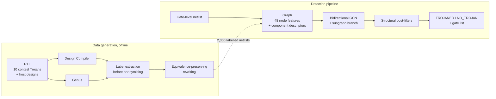
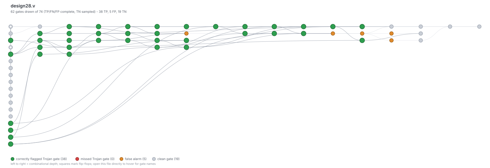
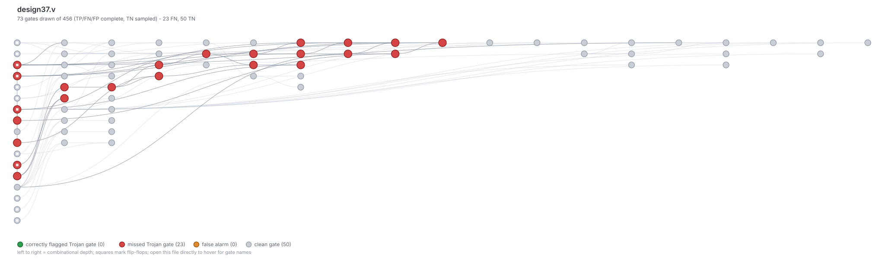

# Hardware Trojan Detection on Gate-Level Netlists

Finding maliciously inserted logic in a synthesised circuit, without a golden
reference, using a graph neural network over the netlist itself.

> **ICCAD 2025 CAD Contest — Problem A**, *Hardware Trojan Detection on Gate
> Level Netlist* (sponsored by Cadence Design Systems)
>
> **Top Prize** — individual entry, team ID `cada1033`.
> Official score: **121.89 / 160** over 60 hidden test cases, all 60 executed
> without failure.

### The award

**Top Prize (特優)** in Problem A of the contest's Taiwan domestic division --
the highest of four tiers, and the only one awarded for that problem out of
eleven placing teams.

The CAD Contest at ICCAD runs two parallel divisions on the same problems; this
entry competed in the domestic one. Official results, Problem A, first row:
<https://www.iccad-contest.org/2025/tw/05_results.html>

| Field | Value |
|---|---|
| Award | Top Prize (特優) |
| Team | `cada1033` |
| Student | Huang, Tzu-Chi (黃梓齊) -- National Tsing Hua University |
| Advisor | Prof. Chun-Yao Wang (王俊堯) -- National Tsing Hua University |

*(The results page is in Chinese; the original characters are given so each
field can be matched against it directly.)*

---

## Where to start

| If you want to… | Go to |
|---|---|
| **know in 60 seconds what this is and how it scored** | [The problem](#the-problem) and [Results](#results) below |
| **see the model's actual output** | [What the model actually sees](#what-the-model-actually-sees) — two annotated circuit diagrams, one success and one failure |
| **understand the engineering** | [Approach](#approach) — the data problem, the features, the model, the post-filters |
| **run it yourself** | [Quick start](#quick-start) — clone, then one command with no dependencies at all |
| **know what is in a folder** | [Repository layout](#repository-layout), or open the folder: every one has its own README |
| **check a claim** | [`results/`](results/) holds the official scorecard and the submitted predictions; [`docs/results.md`](docs/results.md) works through them |

Every command in this README was run against a fresh clone before it was
written down.

---

## The problem

Modern chips are assembled from third-party IP. A **hardware Trojan** is
malicious logic inserted somewhere along that supply chain — a few dozen gates
hidden among tens of thousands — that leaks a key, corrupts a result, or
hijacks control flow when a rare trigger condition fires.

Classical detection compares a suspect chip against a known-good "golden"
reference. In practice no such reference exists, which is what makes the
problem hard. The contest formalises the golden-free version:

* **Input** — one flattened gate-level Verilog netlist. Nine primitives only
  (`and`, `or`, `nand`, `nor`, `not`, `buf`, `xor`, `xnor`, `dff`), every
  instance anonymised to `g0, g1, …` and every net to `n0, n1, …`. No module
  names, no comments, no hierarchy: every semantic hint a human would use has
  been stripped.
* **Output** — either `NO_TROJAN`, or `TROJANED` plus the exact set of gate
  instances that constitute the Trojan.
* **Scoring** — 2 points for the correct Trojaned/clean verdict, plus per-gate
  F1 as a bonus of at most 1. Maximum 3 points per case.

Because names carry no information, detection has to come from **structure and
behaviour**: where a gate sits in the graph, and how it behaves under
simulation.

## Results

Official scorecard from the organisers ([`results/official_scorecard_cada1033.xlsx`](results/official_scorecard_cada1033.xlsx)):

| Metric | Value |
|---|---|
| Test cases | 60 (hidden) |
| Executed without crash or timeout | **60 / 60** |
| Correct Trojaned / clean verdict | **50 / 60** |
| **Total score** | **121.89 / 160** (76.2 %) |

The contest scores two different things in one number, and they came out very
differently. Cross-referencing the scorecard against the submitted predictions
([`docs/results.md`](docs/results.md)) recovers the hidden set's composition —
40 Trojaned designs, 20 clean — and separates them:

| | Result |
|---|---|
| **Is this design Trojaned?** | precision **87.5 %**, recall **87.5 %**, F1 **0.875** (35 of 40 Trojans found, 5 false alarms) |
| **Which gates are the Trojan?** | median F1 **0.77** across the 35 designs correctly flagged; one case reached a perfect 1.000 |

Design-level detection is the strong part. Gate-level localisation is
respectable when the Trojan is found at all. The headline "mean F1 = 0.365"
that the scorecard reports is low mainly because it averages in the 20 clean
designs, where F1 is defined as zero.

**On the denominator.** The scorecard reports a nominal maximum of 180, three
points per case, but no entry could have reached it: the F1 bonus is only
awarded on designs that really are Trojaned, so a clean design caps at the two
verdict points. With this set's actual composition — 40 Trojaned, 20 clean —
the maximum any submission could score was **160**, which is the denominator
used here.

### What is and is not reproducible here

`models/trojan_gnn.pt` **is the submitted checkpoint**, byte for byte — nothing
was retrained while preparing this repository. `results/contest_submission/`
holds the 60 prediction files exactly as they were scored.

The 121.89 itself cannot be re-derived locally: the 60 test cases were never
released, and no clone of this repository contains them. Any number you produce
by running the code is a number on *different* data — the six sample designs in
`data/holdout/` score 14.24 / 18, which is a demonstration that the pipeline
runs end to end, not a restatement of the contest result. The scorecard and the
submitted predictions are what pin the official figure down, and both are in
this repository so the arithmetic can be checked.

## Approach



### 1. The training-data problem, and how it was solved

The contest supplies ten reference Trojans. Ten examples cannot train a network
that generalises to Trojans nobody has published — so most of the engineering
effort went into **manufacturing a corpus**, not into the model.

Three generation pipelines produce **2,300 labelled netlists**
([`synthesis/`](synthesis/), [`src/augment_netlists.py`](src/augment_netlists.py)):

| Pipeline | Netlists | Trojan gate share | What it contributes |
|---|---:|---:|---|
| Design Compiler | 1,500 | 500 files 100 %, 1,000 files ~8 % median | Realistic host-plus-Trojan designs, and standalone Trojans as pure positives |
| Genus | 500 | 100 % | The *same* RTL through a different vendor's synthesiser |
| Equivalent rewriting | 180 | 16.7 % | Many structural presentations of identical logic |
| Trojan-free | 120 | 0 % | Pure negatives, from 10 distinct base circuits |

Three ideas make this corpus useful rather than merely large:

**Synthesis is what makes labelling possible.** We know which *RTL module* is
the Trojan, but training needs to know which *gates* are. Flattening a
hierarchical design preserves hierarchy inside the instance names, so a gate
that came out of the Trojan module still carries `trojan` in its escaped name.
Labels are extracted at that moment — before the anonymising rename to
`g0, g1, …` that produces the contest format. Both flows are configured to keep
the Trojan intact: sequential constant propagation and flop merging are
disabled, because Trojan trigger logic is *deliberately* near-constant and an
optimiser would happily delete the exact structure the model needs to learn.

**Two synthesisers, on purpose.** Design Compiler and Genus map the same RTL to
visibly different gate structures. Training on both stops the model keying on
one vendor's idioms — the hidden test set was synthesised by the organisers,
not by us.

**Logic-preserving rewriting.** Each gate is rewritten into an equivalent
sub-circuit with some probability: `NAND → AND + NOT`, `XOR → four NANDs`, De
Morgan pairs, double inversion. The structure changes substantially, and Trojan
labels are carried onto whichever gates replace a labelled one. This is the
direct countermeasure to a network memorising *"this exact NAND-XOR shape is a
Trojan"*.

Equivalence here is checked rather than assumed — a rewrite rule with one input
on the wrong net still parses, still trains, and quietly poisons the corpus.
[`tools/check_augmentation.py`](tools/check_augmentation.py) verifies it at two
levels: every rule against the gate it replaces over its **complete truth
table**, and whole augmented netlists against their sources by simulation.

```
rules checked: 15 | netlists checked: 18 | failures: 0
augmentation is function-preserving.
```

### 2. Feature engineering

Each gate becomes a node carrying **48 features** (35 active after ablation),
grouped by the hypothesis each family encodes
([`src/build_graph.py`](src/build_graph.py)):

| Family | Features | Why a Trojan should look different |
|---|---|---|
| Gate type | 9 one-hot | Baseline identity |
| Flip-flop pin role | 5 | Gating a clock or forcing a reset is a classic payload |
| I/O flags | 2 | Trojans avoid primary outputs |
| Local structure | 5 | Payload logic is sparsely attached to its host |
| Graph distances | 16 | Distance to PI / PO / register boundary, min and max, combinational paths only |
| Neighbourhood | 4 | Four-hop reach and gate-type diversity around the gate |
| Static probability | 1 | Signal probability under an independence assumption |
| Simulation tallies | 5 | Transition counts and longest constant runs over 1,000 random vectors |

The simulation tallies target the defining property of a Trojan trigger: it is
engineered to **stay quiet** until a condition that essentially never occurs.
A gate that never toggles across a thousand random input vectors is exactly
what that looks like from the outside.

Feature selection and scaling are switches at the top of `build_graph.py`,
left at the values the shipped checkpoint was trained with: **13 of the 48
columns are zeroed, and per-design min-max scaling is off**, so the network
sees raw magnitudes.

That second setting is worth pausing on. Normalised per design, a distance of
0.5 does not mean the same thing in a 500-gate circuit and a 20,000-gate one —
and generalising across exactly that gap is what the hidden test set measures.
Raw magnitudes keep the comparison honest at the cost of a wider input range.
Either switch changes what `data.x` means, so flipping one invalidates the
shipped weights.

### 3. Model

Two branches feed one per-gate classifier ([`src/gnn.py`](src/gnn.py)):

* **Node branch** — three bidirectional GCN blocks. A netlist is a *directed*
  graph, and both directions carry signal: what drives a gate, and what the
  gate drives. Each block convolves over forward and reversed edges separately
  and fuses them. All three blocks' outputs are concatenated rather than only
  the last, keeping 1-, 2- and 3-hop views available — a trigger is often
  recognisable locally, and deep message passing smears that away.

* **Subgraph branch** — cutting the graph at flip-flop boundaries decomposes
  the design into weakly-connected components. An inserted Trojan is usually
  *structurally separable*: its payload forms a small component, weakly attached
  to the host. Each component is described by 21 numbers (size, internal edges,
  density, boundary edges and ratio, gate-type histogram, feature means) and
  every gate is classified alongside the component it lives in. This is
  information no amount of local message passing recovers.

Training uses **focal loss** — Trojan gates are a small minority, so plain
cross-entropy is minimised by predicting "clean" everywhere — and selects the
checkpoint by **F1 rather than loss**, because with this imbalance the
lowest-loss epoch is routinely not the best-F1 epoch.

### 4. Post-processing

Raw per-gate output is noisy: the network fires on scattered individual gates
that look locally unusual. A real Trojan is never one isolated gate — it is a
connected block of trigger and payload logic. Three filters exploit that
([`src/predict.py`](src/predict.py)):

1. **Isolated-gate removal** — drop a positive with no other positive within
   *n* hops.
2. **Small-cluster removal** — drop connected groups below a size threshold.
3. **Minimum-total gate** — if fewer than 10 gates survive, declare the design
   clean.

Step 3 is a direct reading of the scoring function. A correct verdict is worth
2 points and F1 adds at most 1, so a handful of low-confidence positives on a
clean design is a bad bet: it risks 2 points to chase a fraction of one. It
reduces false alarms rather than eliminating them — five clean designs still
produced clusters large and connected enough to survive all three filters.

## What the model actually sees

The visualiser renders a netlist as a graph coloured by detection outcome —
green correctly flagged, red missed, orange false alarm, grey clean — laid out
left-to-right by combinational depth. It needs no dependencies beyond the
standard library.

A design of a few thousand gates is unreadable at any zoom, so the drawing is
cropped to the flagged and labelled gates plus three hops of surrounding logic.
The crop is seeded from *every* non-clean gate, so the green, red and orange
counts shown are complete for the whole design; only the grey ones are a
sample. Each figure states its own crop.

**A success.** `design28`, 74 gates: all 38 Trojan gates found, 5 false alarms,
F1 0.94. The Trojan sits in a 49-gate component that is **78 % Trojan** — it
dominates the component it lives in, which is exactly the signal the subgraph
branch keys on.



**A failure.** `design37`, 456 gates: 23 Trojan gates, none found. Here 19 of
those 23 are absorbed into the host's main 388-gate component, where they make
up **5 %** of it. There is no distinctive component to find, and the node branch
alone does not compensate.



That contrast is not anecdotal. Measuring, for each design, the Trojan's share
of the component holding most of it:

| Design | Trojan gates | Component purity | Found? | Gate F1 |
|---|---:|---:|:--:|---:|
| design22 | 33 | 100 % | yes | 1.000 |
| design0 | 71 | 100 % | yes | 0.513 |
| design32 | 51 | 100 % | yes | 0.814 |
| design28 | 38 | 78 % | yes | 0.938 |
| design38 | 41 | 31 % | yes | 0.975 |
| **design37** | 23 | **5 %** | **no** | 0.000 |

Mean purity where the Trojan was found: **82 %**. Where it was missed: **5 %**.
Six designs is too few to call this settled, but it matches the failure pattern
on the hidden set, and it says where the work is: the model needs a signal for
Trojans that *do not* decompose.

```bash
python tools/visualize_netlist.py \
    --netlist   data/holdout/netlists/design28.v \
    --truth     data/holdout/labels/result28.txt \
    --predicted build/predictions/result28.txt \
    --out       design28.svg
```

## Repository layout

The evaluated program is the inference path: given one netlist, produce one
result file. Everything else in here built the model or checks it, and never
ran during evaluation. The tree marks which is which.

```
.
├── src/                        Detection pipeline
│   ├── netlist_parser.py       * Flat Verilog reader (standard library only)
│   ├── dataset.py              * Label file format and naming conventions
│   ├── build_graph.py          * Netlist -> feature graph  (step 1)
│   ├── gnn.py                  * Model definition, shared by train and predict
│   ├── predict.py              * Inference + post-filters (step 3)
│   ├── public_case_lookup.py   * Contest-only shortcut; see the note below
│   ├── train.py                  Training loop            (step 2)
│   └── augment_netlists.py       Logic-preserving rewriting for augmentation
├── synthesis/                  RTL -> contest-format netlist generation
│   ├── design_compiler/          Synopsys DC scripts + cell library
│   ├── genus/                    Cadence Genus scripts + cell library
│   ├── convert_to_contest_format.py
│   └── extract_trojan_labels.py
├── tools/                      Standard-library-only utilities
│   ├── smoke_test.py             Verify a fresh clone works
│   ├── check_augmentation.py     Prove the rewrites preserve function
│   ├── visualize_netlist.py      Render detection results to SVG
│   └── build_dataset_manifest.py Summarise the generated corpus
├── data/
│   ├── trojan_definitions/       The 10 contest Trojans, as RTL
│   ├── public_benchmark/         Sample of the released public cases
│   ├── holdout/                  Sample of our own held-out split
│   └── dataset_manifest.csv      All 2,300 generated netlists, one row each
├── models/trojan_gnn.pt      * Trained checkpoint (the contest submission)
├── results/                    Official scorecard + submitted predictions
├── problem_info/               Official problem statement (PDF)
├── docs/                       Dataset and results write-ups, plus figures
└── requirements.txt            PyTorch + PyG; required by src/, not by tools/
```

`*` marks the six modules plus the checkpoint that make up the evaluated
inference path — verified by walking `predict.py`'s import graph. The contest
ran it one netlist at a time (`./cada1033_alpha -netlist design.v -output
result.txt`); `predict.py` is the same pipeline driven over a directory.
`train.py`, `augment_netlists.py`, `synthesis/` and `tools/` are offline: they
produced the corpus, trained the model, or check the result.

**On the dataset.** The full generated corpus is ~106 MB of Verilog plus the
intermediate tensors, which is not worth distributing. What ships instead is
the generation pipeline that produced it, representative samples, and
[`data/dataset_manifest.csv`](data/dataset_manifest.csv) — one row per generated
netlist with its pipeline, Trojan type, gate count and label count. Every
dataset figure quoted above is reproducible from that manifest:

```bash
python tools/build_dataset_manifest.py --corpus <generated_data> --out manifest.csv
```

## Quick start

Verified on Python 3.12.7 (Windows) and on Python 3.14 for the standard-library
tools. Every command below was run before being written down.

### 1. Clone and check the repository works — no dependencies needed

```bash
git clone <this repository>
cd iccad-2025-hardware-trojan-detection
python tools/smoke_test.py
```

Expected: `15 passed, 0 failed, 2 skipped` (the two skips are the PyTorch tiers).

### 2. Install and run detection

```bash
# CPU-only PyTorch is a much smaller download and is all that is needed
pip install torch --index-url https://download.pytorch.org/whl/cpu
pip install -r requirements.txt

python tools/smoke_test.py          # now: 28 passed, 0 failed, 0 skipped
```

Run the trained model over the sample hold-out designs:

```bash
python src/predict.py \
    --netlists data/holdout/netlists \
    --labels   data/holdout/labels \
    --model    models/trojan_gnn.pt \
    --out      build/predictions
```

This scores 14.24 / 18 on those six designs and takes about seven seconds on a
laptop CPU. Predictions land in `build/predictions/` in contest format.

That 14.24 / 18 is *not* the contest result rescaled — it is the same
checkpoint measured on six sample designs. The official 121.89 / 160 was
measured on 60 hidden cases that were never released.

> **Important:** leave `--sims` at its default of 1000. The switching-activity
> features are raw counts, so the value used at inference must match the value
> used in training. Running with `--sims 100` on these same six designs scores
> 8.39 / 18 instead of 14.24 — the model is unchanged, the features are simply
> ten times smaller than it expects.

### 3. Retrain from netlists

```bash
python src/build_graph.py --netlists data/holdout/netlists \
                          --labels   data/holdout/labels \
                          --out      build/graphs

python src/train.py --graphs build/graphs --out build/my_model.pt
```

(Six designs is a demonstration, not a training set. The shipped checkpoint was
trained on the full 2,300-netlist corpus.)

### 4. Regenerate training data

Augmentation runs anywhere, and can be checked immediately:

```bash
python src/augment_netlists.py --netlists data/holdout/netlists \
                               --labels   data/holdout/labels \
                               --out      build/augmented \
                               --rate 0.2 --variants 3

python tools/check_augmentation.py --original  data/holdout/netlists \
                                   --augmented build/augmented/netlists
```

The synthesis flows in `synthesis/` require **Synopsys Design Compiler** or
**Cadence Genus** licences and will not run without them. They are included
because they are how the corpus was built, not because they are reproducible on
a personal machine. See [`synthesis/README.md`](synthesis/README.md).

## Honest notes and limitations

* **Ten cases scored zero, and they split evenly into two failure modes.**
  Five were Trojaned designs reported clean; five were clean designs reported
  Trojaned. Both trace to the same weakness — Trojans that do not form a
  separable component defeat the subgraph branch, which is the model's main
  structural signal. `design37` above is a local instance: 23 Trojan gates,
  none found.

* **Gate-level localisation is imprecise even when detection succeeds.**
  Of the 35 correctly-flagged Trojaned designs, the median F1 is 0.77 — good,
  but one case flagged a gate set with *zero* overlap with the real Trojan
  while still earning the verdict points. A correct verdict does not imply the
  model found the right thing.

* **The threshold sits deliberately on the recall side.** Seventeen cases
  achieved recall 1.000; nine of those had precision below 0.20, sweeping up
  several times as much host logic as Trojan. Those nine still contributed 19.8
  points, because a correct verdict is worth twice the maximum F1 bonus.

* **`public_case_lookup.py` is a contest shortcut, not detection.** It hashes
  the organisers' released public netlists and returns their published answers
  on an exact match. It contributes nothing on unseen designs. In this
  repository it is **off by default** — `predict.py` only consults it when
  given `--public-cases`, and its report always separates lookup answers from
  model answers, so the numbers above are the model's own. It is kept, and
  documented here rather than quietly deleted, because it was part of the
  submitted program.

* **The shipped checkpoint predates the augmentation verifier.**
  `tools/check_augmentation.py` was written while preparing this repository,
  and it found that three of the longer rewrite rules — the five-gate `XOR` and
  `XNOR` expansions and the four-NAND `XOR` — were mis-wired, because the
  original code inferred wiring from gate order instead of stating it. Those
  rules are correct here and proven by exhaustive truth table, but part of the
  corpus that trained `models/trojan_gnn.pt` was generated before the fix and
  will have contained some non-equivalent variants. The contest result above is
  unaffected — it is the score that submission actually received — but a
  retrained model would not be starting from identical data.

* **Training metrics in `train.py` are computed on the training set.**
  Held-out evaluation is `predict.py`'s job.

* **Simulation is 1,000 random vectors, not exhaustive.** A trigger rarer than
  roughly 1-in-1000 is indistinguishable from a constant signal at this budget.
  Raising `--sims` costs linear time and would need retraining to exploit.

## References

* [`problem_info/A_20250729.pdf`](problem_info/A_20250729.pdf) — the official problem statement (Cadence Design Systems, rev. 2025-07-29)
* [2025 ICCAD CAD Contest Problem A: Hardware Trojan Detection on Gate-Level Netlist](https://ieeexplore.ieee.org/document/11240658/) — the invited paper
* [Overview of the 2025 CAD Contest at ICCAD](https://ieeexplore.ieee.org/document/11240649/)
* [Official contest site](https://www.iccad-contest.org/2025/)
* [Official results — domestic division](https://www.iccad-contest.org/2025/tw/05_results.html) — Problem A, 特優 (Top Prize), team cada1033

## Author

**Huang, Tzu-Chi (黃梓齊)** — National Tsing Hua University, Department of
Computer Science. Advisor: Prof. Chun-Yao Wang.

Sole entrant, team ID `cada1033`, ICCAD 2025 CAD Contest Problem A — awarded
**Top Prize (特優)** in the Taiwan domestic division. The detection pipeline,
the synthesis and augmentation flows that built the training corpus, and the
tooling in this repository are all my own work.

Further detail: [`docs/dataset.md`](docs/dataset.md) — how the training corpus
was built · [`docs/results.md`](docs/results.md) — case-by-case analysis of the
official scorecard
